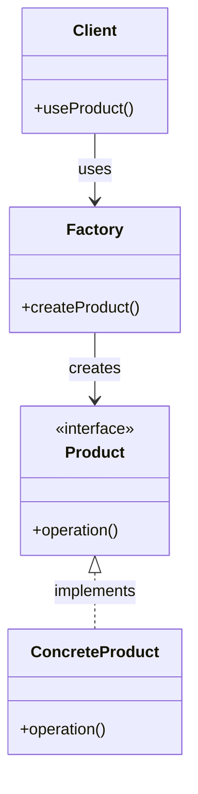

# State Pattern (狀態模式)

## 概述

狀態改變行為。

## 特性

### 目的
- 狀態改變行為

### 適用場景
- 需要根據不同條件創建不同物件
- 創建邏輯相對簡單
- 客戶端不需要知道具體類別

### 優點
- 封裝創建邏輯
- 客戶端簡化
- 易於維護

### 缺點
- 違反開放封閉原則
- 工廠類別職責過重
- 難以擴展

## 架構圖



## 參與者

### Factory (工廠)
- 負責創建物件的工廠類別
- 根據參數決定創建哪種物件
- 封裝創建邏輯

### Product (產品)
- 定義產品的共同介面
- 所有具體產品都實作此介面

### ConcreteProduct (具體產品)
- 實作 Product 介面的具體類別
- 提供具體的產品功能

### Client (客戶端)
- 使用工廠創建產品
- 不需要知道具體產品類別

## 實作範例

### 自動販賣機範例
在這個範例中，我們實作了一個自動販賣機：

- **工廠類別**: 負責創建不同物件
- **產品介面**: 定義產品的共同行為
- **具體產品**: 各種具體實作

### 關鍵程式碼結構

```csharp
// 產品介面
public interface IProduct
{
    void Operation();
}

// 工廠類別
public class Factory
{
    public static IProduct CreateProduct(string type)
    {
        // 創建邏輯
    }
}
```

## 實際應用場景

1. **UI 元件創建**: 根據類型創建不同 UI 元件
2. **資料庫連接**: 根據配置創建不同資料庫連接
3. **檔案處理**: 根據檔案類型創建不同處理器
4. **遊戲物件**: 根據類型創建不同遊戲物件
5. **通知系統**: 根據類型創建不同通知方式

## 與其他模式的關係

### 與其他創建型模式的比較
- **Simple Factory**: 靜態方法，違反開放封閉原則
- **Factory Method**: 虛擬方法，符合開放封閉原則

## 最佳實踐

1. **簡單邏輯**: 只適用於創建邏輯相對簡單的場景
2. **避免過度使用**: 不要用於複雜的創建邏輯
3. **考慮擴展**: 如果可能擴展，考慮使用其他模式
4. **命名規範**: 使用描述性的方法名稱

## 常見陷阱

1. **違反開放封閉原則**: 新增產品需要修改工廠類別
2. **職責過重**: 工廠類別承擔過多職責
3. **難以測試**: 靜態方法難以進行單元測試
4. **擴展困難**: 新增產品類型需要修改現有程式碼

## 測試建議

1. **工廠測試**: 測試工廠創建各種產品
2. **異常測試**: 測試無效參數的處理
3. **產品測試**: 測試具體產品的功能
4. **整合測試**: 測試客戶端使用工廠

## 總結

狀態模式是一個重要的Behavioral模式，適合狀態改變行為的場景。它提供了良好的封裝性，但需要注意開放封閉原則的問題。
